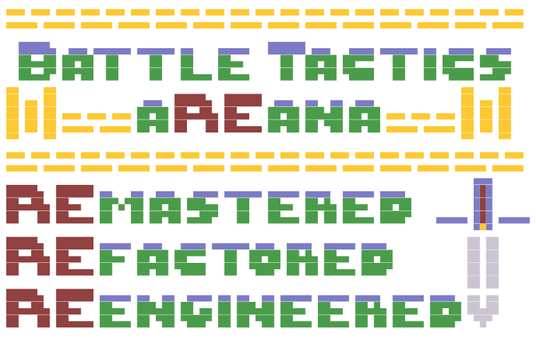

# ⚔️ BTA-RRR: Battle Tactics Arena — Refactored & Remastered




[](https://theonliestmattastic.github.io/)
[](https://github.com/theonliestmattastic)
[](mailto:matthew.poole485@gmail.com)

## 🔭 Overview

**BTA-RRR** is a turn-based tactical grid combat game built in **LÖVE2D** (Lua framework). Originally a monolithic CS final project, it's been completely refactored into a modular, well-documented codebase following clean architecture principles.

The game features:
- **16x16 grid-based tactical combat** with 30+ character classes
- **Vim-style navigation** (hjkl + arrows) — a dual-purpose system for practicing vim while playing
- **Turn-based initiative system** with action points and resource management
- **State machine architecture** separating game logic from presentation
- **Professional Lua patterns** — metatables, dependency injection, data-driven design

The codebase is designed to be readable and maintainable, with clear separation of concerns and every design decision documented.

## 🎮 Quick Start

### Prerequisites

- **LÖVE2D** (0.10.2 or later) — Download from [love2d.org](https://love2d.org/)
- **Git** — For cloning the repo
- **Lua 5.1+** — Usually bundled with LÖVE2D

### Installation & Running

```bash
# Clone the repository
git clone https://github.com/TheOnliestMattastic/BTA-RRR.git
cd BTA-RRR

# Run with LÖVE2D
love .
```

That's it. The game boots directly from `main.lua`.

## 🕹️ Gameplay Controls

### Keyboard

- **hjkl** — Vim-style movement (h=left, j=down, k=up, l=right)
- **Arrow Keys / WASD** — Alternative directional input
- **Tab** — Toggle focus between map and action menu
- **j/k** — Navigate menu up/down (when menu has focus)
- **Space** — End turn
- **Return** — Confirm action (move, attack, etc.)
- **Escape** — Quit game

### Mouse

- **Move** — Hover over tiles for visual feedback
- **Left Click** — Select tiles, characters, or activate menu buttons
- **Release** — Confirm action (buttons activate on release)

## 🗂️ Project Structure

```
main.lua                 # Entry point, state machine, window setup
├── states/              # Game states (menu, game loop)
│   ├── menu.lua         # Main menu state
│   └── game.lua         # Main gameplay loop and orchestration
├── core/                # Game logic and systems
│   ├── character.lua    # Character entity, stats, animations
│   ├── gameState.lua    # Turn order, win conditions, AP management
│   ├── turnManager.lua  # Initiative rolls, turn progression
│   ├── inputHandler.lua # Keyboard/mouse/vim input routing
│   ├── gameUI.lua       # HUD rendering (stats, menu, turn order)
│   ├── map.lua          # Tile grid, collision, rendering
│   ├── gameLogic.lua    # Combat calculations, damage, range checks
│   ├── assetRegistry.lua # Centralized asset loading
│   └── gameInit.lua     # Setup and dependency injection
├── config/              # Data (not logic)
│   ├── characters.lua   # Character class definitions (30+)
│   ├── tilesets.lua     # Tileset/map configurations
│   ├── ui.lua           # UI layout constants
│   └── fx.lua           # Visual effects (damage numbers, etc.)
├── lib/                 # Third-party libraries
│   └── anim8.lua        # Animation library (vendored)
└── assets/              # Sprites, fonts, tilesets
    ├── sprites/chars/   # Character spritesheets
    └── fonts/           # Game fonts
```

**Key Architectural Principle:** Data lives in `config/`, logic lives in `core/`, presentation lives in `states/`. No circular dependencies.

## 💬 Code Standards (WHAT/WHY/HOW)

Every function follows a structured comment pattern:

```lua
-- =============================================================================
-- MODULE_NAME
-- =============================================================================
-- WHAT: One sentence describing what this does
-- WHY:  One sentence explaining why it's needed
-- HOW:  One sentence explaining the implementation approach
-- NOTE: [Optional] Gotchas, alternatives, or reminders
-- =============================================================================
```

This isn't busy-work—it makes code **self-documenting** and **intentional**. You know exactly why something exists.

## 🎯 Design Philosophy: KISSME

- **Keep It Stupidly Simple** — Code clarity over cleverness. If it's complex, break it smaller.
- **Modularize Everything** — Each module has one job. Find what you need fast.
- **Data-Driven** — Configuration lives in tables; logic stays in functions.
- **Object-Oriented** — Lua metatables for clean entity management (Character, GameState, Map, etc.)

No over-engineering. No premature optimization. Just clean, readable, maintainable code.

## 📚 Core Systems

### Turn System

- **Initiative**: D&D-style `d20 + SPD` roll (see `turnManager.lua`)
- **Action Points (AP)**: Gained at turn start (usually +2, capped at 4)
- **Movement**: Manhattan distance calculation, validates range before execution
- **Combat**: Range check + damage formula: `damage = attacker.pwr - defender.def` (with minimum 1)

### Character Classes

30+ distinct classes with unique stat profiles:

| Stat | Range | Purpose |
|------|-------|---------|
| HP | 12-32 | Health pool |
| PWR | 4-8 | Damage output |
| DEF | 1-8 | Damage reduction |
| DEX | 2-6 | Hit accuracy/evasion |
| SPD | 2-5 | Movement range + initiative modifier |
| RNG | 1-4 | Attack range |

See `config/characters.lua` for the full roster (Ninjas, Samurai, Mages, Brawlers, Knights, etc.).

### Map & Collision

- 16x16 tile grid, 32px per tile
- Randomized tileset selection (procedural variety)
- Character collision detection
- Range highlighting for movement/attacks

## 🚀 Development Workflow

### Adding a New Character Class

1. **Add entry to `config/characters.lua`** with stats, sprite path, animation definitions
2. **Add sprite sheets** to `assets/sprites/chars/<className>/`
   - SpriteSheet.png (16x16 frames, 4 directions, 3-5 animation states)
   - Faceset.png (portrait for UI)
3. **Register in `states/game.lua`** by instantiating with `Character.new(className, x, y, stats)`
4. **Test locally** with `love .`

### Adjusting Game Balance

All balance lives in `config/characters.lua` (stats) or `core/character.lua` (AP gain):

```lua
function Character:gainAP(amount)
    self.ap = math.min(self.ap + (amount or 2), self.maxAP)  -- Change "2" to adjust
end
```

### Debugging Input Flow

- `inputHandler:getFocus()` returns "map" or "menu"
- `inputHandler.uiFocus` shows which UI element has focus
- Print input in `states/game.lua` keypressed/mousepressed handlers

## 📋 Known Limitations & Roadmap

### Current Gaps

- **Action menu buttons are placeholders** — Not all actions are implemented yet
- **No persistent saves** — Game state doesn't persist between sessions
- **No AI opponents** — Multiplayer/AI would be next-level features
- **No ability system** — Tags exist in character data but aren't used yet
- **No diagonal movement** — Animations locked to cardinal directions

### Refactoring Priorities (for recruiter appeal)

1. **Implement Ability System** — Registry with cost/range/effects (shows system design)
2. **Event Bus Architecture** — Replace direct function calls with event system (loose coupling)
3. **Data Serialization** — Save/load with proper schema (production readiness)
4. **Unit Tests** — Test game logic: damage calculations, range checks (quality assurance)
5. **Performance Profiling** — Document optimization decisions (engineering rigor)

## 🛠️ Useful Commands

```bash
# Run game
love .

# Check code syntax
lua -c core/character.lua

# View recent commits
git log --oneline -10

# Find all TODOs
grep -r "TODO" core/
```

## 🎓 Learning Resources

If you're curious about **game architecture**, check these out:

- **LÖVE2D Manual**: https://love2d.org/wiki/Main_Page
- **Game Programming Patterns**: https://gameprogrammingpatterns.com/ (state machine, entity systems, etc.)
- **Lua Best Practices**: https://www.lua.org/pil/ (metatables, module design)
- **This Project's AGENTS.md**: Architecture guidelines, comment standards, design philosophy

## 🛸 License

This project is licensed under the [Creative Commons Attribution-ShareAlike 4.0 International License](https://creativecommons.org/licenses/by-sa/4.0/).

## 👽 Contact

Curious about my approach to architecture, code design, or game development? Want to discuss refactoring strategies or hire for a role where clean code matters?

[](https://theonliestmattastic.github.io/)
[](https://github.com/theonliestmattastic)
[](mailto:matthew.poole485@gmail.com)

> *"The only way to do great work is to love what you hate."* — Deliberately Inverted
